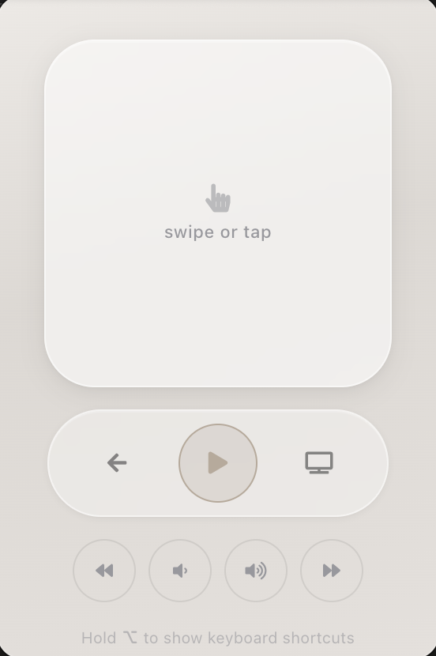
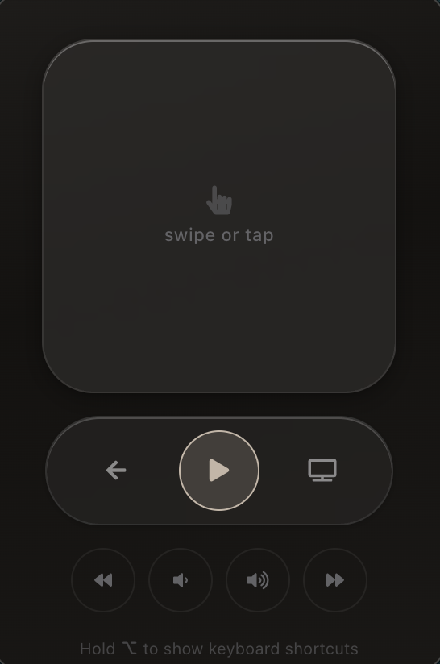

# ATV Desktop Remote

A menubar app to control an Apple TV from your desktop. Runs purely in Node.js using [node-appletv-remote](https://github.com/energee/node-appletv-remote) - no Python environment or pyatv required. Compatible with tvOS 26.2.

  
  &nbsp;&nbsp;
  

## Installation

macOS and Windows builds are available on the [releases page](https://github.com/energee/appletv-desktop-remote/releases).

## Usage

- The app runs in the menubar - click the remote icon to open, right-click for options.
- Use the **touchpad** to swipe or tap, just like a real Apple TV remote.
- **Long-press** any button to simulate a long press on the remote.
- Hold **Option** (or **Alt** on Windows) to reveal keyboard shortcuts.
- Press `Cmd+Shift+R` to open the app from anywhere (`Win+Shift+R` on Windows).

### Keyboard Shortcuts

| Key | Action |
|-----|--------|
| Arrow keys | Navigate |
| Enter | Select |
| Space | Play / Pause |
| Esc / Backspace | Menu |
| T | Home (TV) |
| L | Long-press Home |
| G | Top Menu |
| [ / ] | Skip backward / forward |
| + / - | Volume up / down |

## Running from Source

### Prerequisites

- [Node.js](https://nodejs.org/) v20+
- [pnpm](https://pnpm.io/)

### Setup

1. `pnpm install`
2. `pnpm start`
3. The first time the app runs it will pair with an Apple TV. You can pair with more than one device.

## Building

`electron-builder` is used to create standalone applications.

| Command | Target |
|---------|--------|
| `pnpm build` | macOS (current arch) |
| `pnpm build-arm` | macOS (ARM64) |
| `pnpm build:win` | Windows |

## License

This project is licensed under [CC BY-NC-SA 4.0](https://creativecommons.org/licenses/by-nc-sa/4.0/).